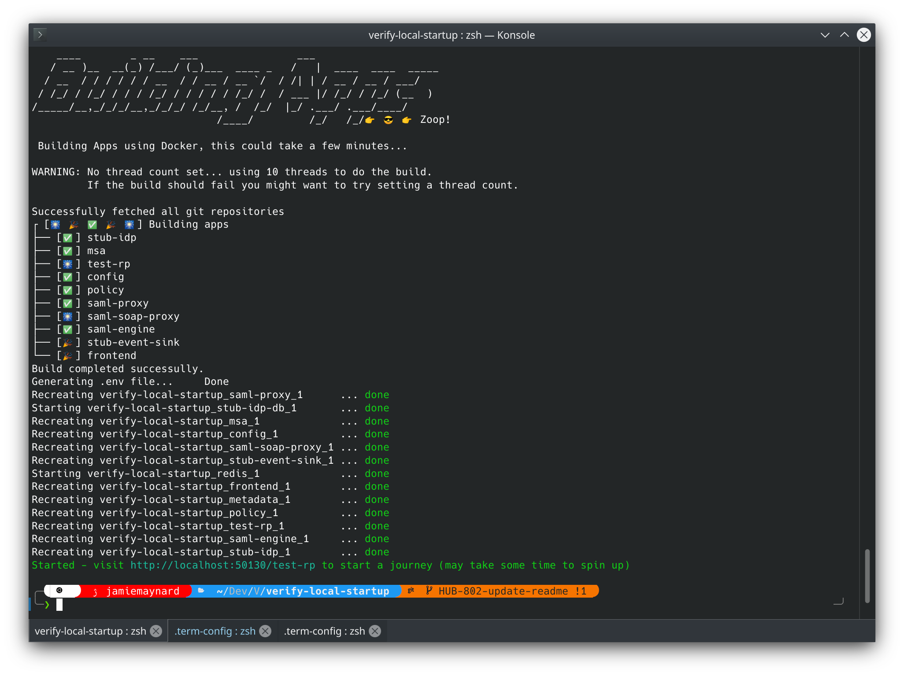

# Verify Local startup

This repositories primary purpose is to allow anyone the ability to build and run the Verify Hub and related microservices.  It makes extensive use of Git, Docker and Ruby to get the job done.

This repository also provides a number of scripts for generating a new Public Key Infrastructure (PKI) used by the verify applications.

## Contents

* [Before you start](#before-you-start)
* [Getting Started](#getting-started)
* [Stopping the Hub](#stopping-the-hub)
* [Startup Commandline Options](#Startup-Commandline-Options)
* [Useful Scripts](#useful-scripts)
    * [XMLSecTool in Docker](#XMLSecTool-in-Docker)
    * [Generate PKI](#Generate-PKI)
    * [Create environment for local running](#Create-environment-for-local-running)
* [Support and raising issues](#Support-and-raising-issues)
* [Licence](#Licence)

## Before you start

You'll need a computer with at least 8GB (for linux systems) or 16GB (for Mac and Windows systems) and at least a 4 core processor.  You'll also need administrator privilages in order to installed the required components listed below.

You will need to install Git, [Docker](https://www.docker.com/get-started) and Ruby 2.7.2.  If you have [rbenv](https://github.com/rbenv/rbenv) installed the script will automatically pull and compile the correct version of ruby for you.

Ideally if you are on a Linux based system you'll also need to add yourself to the docker group:

```sh
sudo usermod -a -G docker $(whoami)
```

### Notes for Mac Systems

Docker does not run natively on Mac OS systems and instead uses a Virtual Machine which is controlled by the DockerApp.  Before you start you need to allocate at least 6GB of RAM (Ideally 8GB) to this virtual machine.  Additionally if you increase the number of CPUs allocated from the default of 2 you can improve the build performance.  Details can be found in the [Docker User Manual](https://docs.docker.com/docker-for-mac/#resources).

## Getting Started

To run the hub locally first you need to clone this repository to an empty directory.

```sh
mkdir Verify
cd Verify
git clone https://github.com/alphagov/verify-local-startup.git
cd verify-local-startup
```

Now you're in the `verify-local-startup` directory running the hub should be as simple as:

```sh
./startup.sh
```

If your running on Linux we highly recommend you use the `-d` commandline option which additionally runs [Dozzle](https://dozzle.dev/) on port 50999.  Which allows you to see the logs for the various Hub microservices.

```sh
./startup.sh -d
```
 
If everything works as expected you should see the following message:



> Started - visit [http://localhost:50130/test-rp](http://localhost:50130/test-rp) to start a journey (may take some time to spin up)

It can take up to 5 minutes for the 13 indivual microservices to get going and for you to make a successful verify journey depending on the age and power of your computer.  If you encounter any issues please [raise an issue](#Support-and-raising-issues).

## Stopping the Hub

Stopping the hub is relatively straight forward as we also provide a shutdown script.  To stop all the hub microservices just run:

```sh
./shutdown.sh
```

This will kill all the hub microservices running in Docker and remove their virtual network for you.  This will not remove the docker containers created by the build process.

## Startup Commandline Options

The startup scipt provides a number of command line options and switches which can be accessed from the `--help` option.

```
Usage:

  Options:
    -y, --yaml-file <file>      Yaml file with a List of repos to build.
                                Default ./repos.yml
    -t, --threads <number>      Specifies the number of threads to use to do the
                                the build.  If no number given will generate as many
                                threads as repos.  Suggested 4 threads.
                                On macs the default is 2 on other systems 0.
    -r, --retry-build <number>  Sometimes the build can fail due to resourcing issues
                                by default we'll retry once.  If you want to retry
                                more times set a number here or set it to 0 to not retry.

  Switches:
    -w, --write-build-log       Writes the build log even for successful builds
    -s, --skip-data-check       Skip checking the age of the data directory
    -b, --skip-build            Allows you to skip the build process.  Useful if you've
                                already built everything and your developing something.
    -R, --rebuild-data          Tells the script to remove and rebuild the data directory.
    
  Dozzle (useful on Linux):
    -d, --dozzle                Run Dozzle for docker output viewing on port 50999.
    -p, --dozzleport <number>   Sets the port doozle should run on if you choose to run
                                Dozzle (see the -d switch).  Default 50999

  Tasks:
    -g, --generate-only         Generates the data directory and env files and then exits.
    -c, --clean                 Cleans up the verify local startup directory and exits.

    -h, --help                  Show's this help messagee
```

For Mac OS users you'll want to take note of the `-t <number>` option.  This should ideally match the number of CPUs allocated to your Docker virtual machine.  Additionally if you have intermittent build issues you can icrease the build retry cycle with `-r <number>`.  We aware of an issue that when system resources are constrained can result in build failures normally due to failing unit and acceptance tests.

As highlighted in the Getting Started section for Linux users we highly recommend the `-d` option as this launches Dozzle before running the apps giving a convient log viewer for running docker services.  Mac OS users don't need this so much as the Docker App provides a good log viewer.

The startup script manges both the pki and federation config both stored in the data directory as well as the environment variables files.  The script will replace these when they are older than 2 weeks.  However if they become corrupted for any reason its possiblet to supply `-R` option which tells the script to remove the data directory and env files so they can be regenerated.

The script currently has two tasks.  These are options which run and then exit before the build process starts.  The first is `--generate-only` which just generates the PKI and environment files and exists.

The second is the `--clean` task which removes the data directory and environment files and exits.  This is useful for Linux users where these files are typically created by root. 

## Useful Scripts

This repository provides a number of useful scripts for use with the Verify Apps.  These including Gernating a new PKI and creating environment files for local running.  Both of these things are done automatically for you as part of `startup.sh` script detailed in the previous section.

### XMLSecTool in Docker

Its possible to run XMLSecTool using the verify-local-startup docker image.  To do this run the following from the command line:

```
docker run -it -v $(pwd):/verify-local-startup verify-local-startup /bin/bash
```

Once in the container its possible to run `xmlsectool` from the commandline without having to set anything up or download the tool.

### Generate PKI

`verify-local-startup` can be used to generate an entire PKI federation. Run `./generate/hub-dev-pki.sh` to create the required keys, certificates, federation config data and trust stores in `/data`.

This can also be done using the startup script using the task `--generate-only` which runs the PKI and environemnt generation process and then exits.

```sh
./startup.sh -g
```

### Create environment for local running

`generate-env.rb` can generatne a `local.env` file for running Verify apps locally. The script takes a path to output the generated .env file to. It also, optionally, takes which apps (MSA or VSP) need variables added to the .env file.

#### Example
```
ruby generate-env.rb -f ../verify-matching-service-adapter/local.env
```

This will add variables for all apps to the generated file. To add just the MSA related variables, i.e. excluding the VSP ones, add the argument `-a msa`.

## Support and raising issues

If you think you have discovered a security issue in this code please email [disclosure@digital.cabinet-office.gov.uk](mailto:disclosure@digital.cabinet-office.gov.uk) with details.

For non-security related bugs and feature requests please [raise an issue](https://github.com/alphagov/verify-service-provider/issues/new) in the GitHub issue tracker.

## Licence

[MIT Licence](LICENCE)

This code is provided for informational purposes only and is not yet intended for use outside GOV.UK Verify
